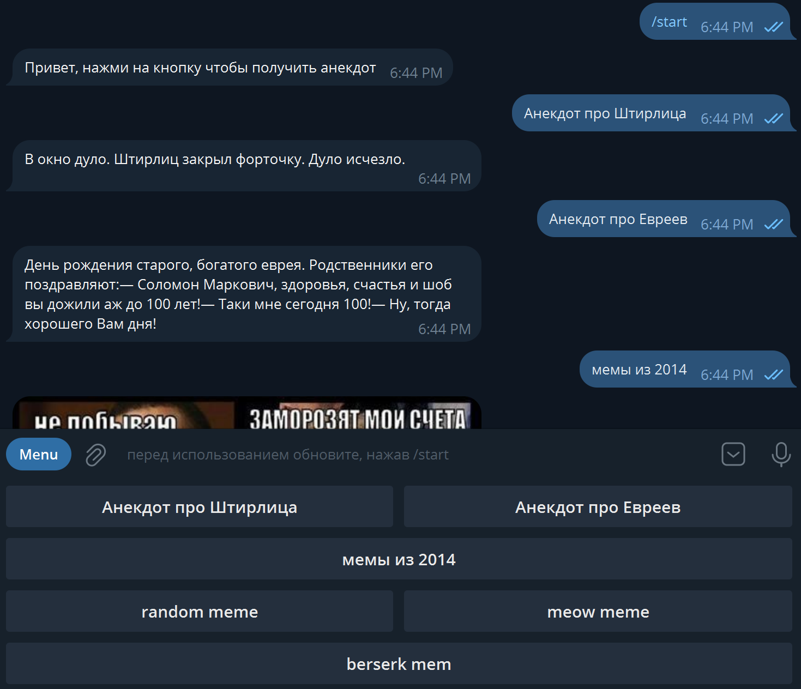

# AnekdotBot.

 Бот с шутками, мемами и анекдотами.

## Структура бота 
**main.py**		основной файл запуска

**.input.txt** 		настройки бота

**settings.py**		чтение настроек из .input.txt

**requirements.txt**		список используемых библиотек


**\handlers**

**interaction_handlers.py**	обработчики

**local_sessions.py**		локальные сессии
		
**\keyboards**	клавиатуры

**\parsing** парсинг сайтов	

## запуск бота

настройка .input 

**BOT_TOKEN** токен бота

**ADMIN_ID** айди аккаунта


создание виртуальной среды
```bash
python -m venv venv
```
активация виртуальной среды
```bash
.\venv\Scripts\activate
```
установка зависимостей
```bash
pip install -r requirements.txt
```
запуск
```bash
py main.py
```


# Работа бота

